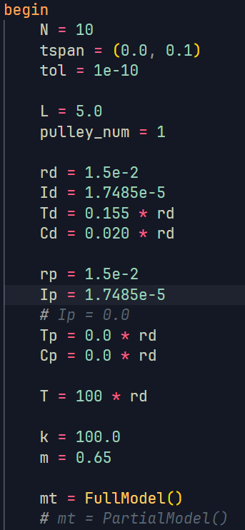
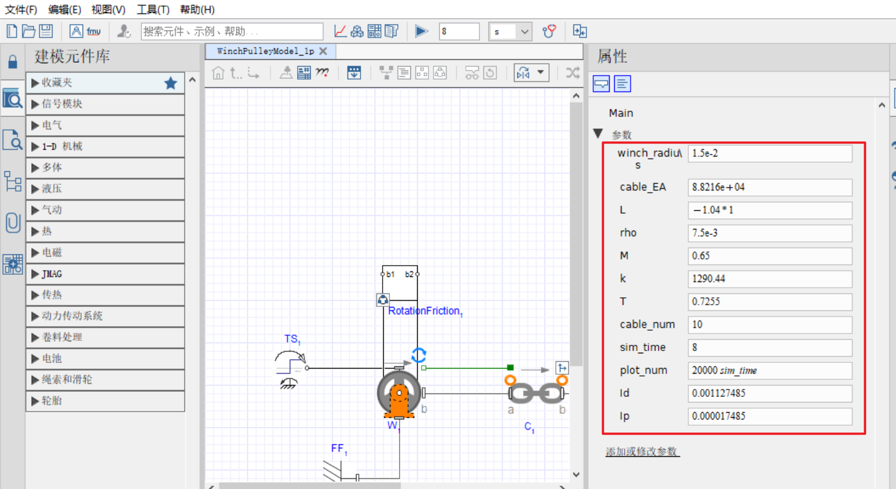

# ABOUT😀

this repository contains code of paper "Longitudinal vibration modeling of hybrid cable-pulley systems with time-varying cable length", the main structure is listed below:

- appendix: contains the resources related to the reviewers' comments
- data: contains the data of this research
- doc: contains some notes about this repository
- src: contains the main code of this research
  - maplesim: maplesim files
  - others: julia code
- README.md
  - this file contains the main instructions about this repository

## REPOSITORY STRUCTURE🤖

### Data File Name Rules👀

- full/partial: full model or partial model data
- N3/5/10: cable segement N=3/5/10
- T50/100/200: cable tenstion is 50/100/200N, represent the torque T=0.75/1.5/3Nm
- ideal: indicates the data in numerical simulation(with ideal) or physical experiment(no symbol)
- 1p/3p: indicates the pulley number, 1 pulley or 3 pulleys

for example, the `full_N3_T50_ideal_1p.mat` represents the data is in experiment with conditions:

- full model
- cable segement N=3
- winch torque T=0.75Nm
- is in numerical simulation
- with 1 pulley

the `partial_N5_3p.mat` represents the data is in experiment with conditions:

- partial model
- cable segement N=5
- winch torque T=0.726Nm(excited by mass gravity)
- is in physical simulation
- with 3 pulley

### CODE FILE STRUCTURES👻

**julia**

- `bc`: contains the initial conditions of the ODE
- `main`: contains the main solve codes, also provide data export and figure illustration generation
- `hybrid_cable_model`: defines the model params and export model types
- `ode`: the odes of the model(full model and partial model)
- `post`: generate data from solver results with given sample frequency(20kHz)
- `util`: util functions of the model(full model and partial model)

**maplesim**

- `WinchPulleyModel_1p`: 1 pulley file of physical experiment
- `WinchPulleyModel_3p`: 3 pulley file of physical experiment
- `WinchPulleyModel_ideal_1p`: 1 pulley file of numerical simulation
- `WinchPulleyModel_ideal_3p`: 3 pulley file of numerical simulation

### APPENDIX FILES

the folders in the appendix directory is orgainsed by the comment, the detial contents are listed below:

- comment1
  - abaqus: contains the abaqus codes related to the fix-length rod vibration case study in the response letter
  - julia: contains the julia codes related to the fix-length rod vibration case study in the response letter
  - mathematica: contains the mathematica codes related to the fix-length rod vibration case study in the response letter
  - ideal_1pulley_deformation_N3.mat: contains the deformation and strain data of the single-pulley case in the manuscript, with the cable segement number set as 3
  - ideal_1pulley_deformation_with_autolimit_strain_N10.mp4: contains the deformation and strian vibration video
  - the following files follow the same naming rule
- comment5
  - ideal_0pulley_deformation_N3.mat: contains the deformation and strain data of the non-pulley case in the manuscript, with the cable segement number set as 3
  - ideal_0pulley_deformation_with_autolimit_strain_N10.mp4: contains the deformation and strian vibration video
  - the following files follow the same naming rule

## HOW TO USE🤠

### FULL MODEL AND PARTIAL MODEL(Julia code)

execute the `main.jl` to simulate the model.

> Because julia has JIT, the first run could be extremely slow due to the compile of packages and codes
> The suggest way to run julia code is to execute it in VSCode, the manuals can be found in:
>
> - [julia official site](https://discourse.julialang.org/)
> - [configuration of julia in VSCode](https://code.visualstudio.com/docs/languages/julia)

- modify the model params and model type as you want. The model params initial values are defined in the `hybrid_cable_model.jl` 
- run the `main.jl` script. The VSCode is suggested as the running platform
- uncomment the lines in the `main.jl` for your purpose
  - for example, if you want to generate the deformation filed video, uncomment the lines 83-142, the related videos will be generated.

### RIGID MODEL(Maplesim code)

The configuration can be changed in maplesim the property panel. Cick the triangular `run` button to simulate the mode.

